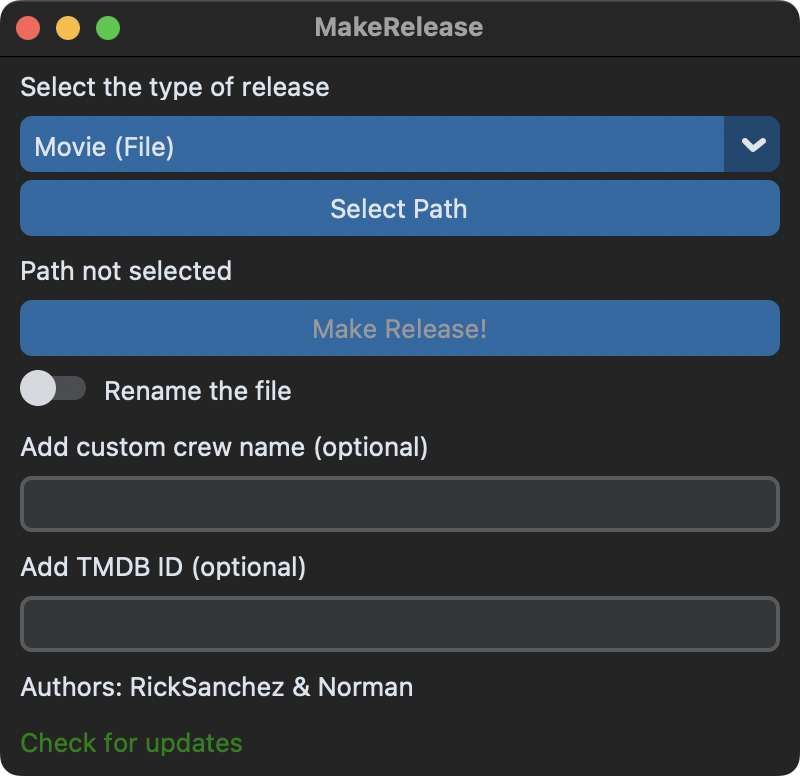

<!-- omit from toc -->

# MakeRelease

[](LICENSE)
[](https://github.com/astral-sh/ruff)
[](https://github.com/psf/black)
[](https://discord.gg/jQmm9jhbyu)

**MakeRelease** è un comodo script per velocizzare la pubblicazione di film e serie tv sul forum MIRCrew! 🚀

> ⚠️ **ATTENZIONE:**
> Questo repository è pubblicato a scopo informativo e didattico.

-   [Funzionalità](#funzionalità)
-   [Requisiti](#requisiti)
-   [Installazione](#installazione)
    -   [Windows](#windows)
    -   [Linux](#linux)
    -   [macOS](#macos)
-   [Aggiornamento](#aggiornamento)
-   [Utilizzo](#utilizzo)
    -   [Tramite GUI](#tramite-gui)
    -   [Tramite linea di comando](#tramite-linea-di-comando)
-   [Autori](#autori)

## Funzionalità

-   Ottiene i dati del film o della serie tv da TheMovieDB
-   Crea il report con MediaInfo (cross-platform) oppure AVInaptic (solo per Windows)
-   Crea il file .torrent
-   Estrae gli screenshot
-   Genera il grafico del bitrate
-   Carica tutte le immagini su Imgur, ImgBB o ImgBly
-   Prepara il testo del post da pubblicare sul forum con tutte le informazioni
-   Formatta il titolo (e opzionalmente rinomina anche il nome del file) seguendo il formato consigliato da MIRCrew

Possibilità di scegliere il tipo di release da effettuare:

-   **Film**

    1. **Film**: seleziona un singolo file `mkv`, `mp4` o `avi`
    2. **Film + Extra**: seleziona una directory contenente un file video e un numero arbitrario di cartelle `Extra`, `Featurettes`, ecc. La procedura è identica al caso precedente, l'unica differenza è l'aggiunta della directory nel torrent.

-   **Serie TV**
    1. **Stagione singola**: seleziona una directory contenente più file video. Lo script identifica la serie dal nome della cartella.
    2. **Serie completa**: seleziona una directory contenente più cartelle. Lo script identifica la serie dal nome della cartella principale.

## Requisiti

-   Python 3.9 (o più recente)
-   FFmpeg
-   MediaInfo (oppure AVInaptic)

## Installazione

### Windows

1. Installa Python
    - `winget install Python.Python.3.12`
2. Installa Git
    - `winget install Git.Git`
3. Clona il repository
    - `git clone https://github.com/c137ricksanchez/automatic-releaser.git`
4. Installa le dipendenze
    - `cd automatic-releaser`
    - `pip install -r requirements.txt`
5. Scarica [FFmpeg](https://github.com/BtbN/FFmpeg-Builds/releases/latest) ed estrai `ffmpeg.exe` e `ffprobe.exe` nella directory di MakeRelease

### Linux

1. Installa Python, Git, FFmpeg e MediaInfo
    - Arch: `pacman -S python python-pip git ffmpeg mediainfo`
    - Debian/Ubuntu: `apt install python3 python3-pip git ffmpeg mediainfo`
    - Fedora: `dnf install python3 python3-pip git ffmpeg mediainfo`
        - _Per installare FFmpeg devi attivare i repository [RPM Fusion](https://docs.fedoraproject.org/en-US/quick-docs/setup_rpmfusion/)_
2. Clona il repository
    - `git clone https://github.com/c137ricksanchez/automatic-releaser.git`
3. Installa le dipendenze
    - `cd automatic-releaser`
    - `pip3 install -r requirements.txt`

### macOS

1. Installa Homebrew
    - `/bin/bash -c "$(curl -fsSL https://raw.githubusercontent.com/Homebrew/install/HEAD/install.sh)"`
2. Installa Python
    - `brew install python3`
3. Installa Git
    - `brew install git`
4. Clona il repository
    - `git clone https://github.com/c137ricksanchez/automatic-releaser.git`
5. Installa le dipendenze
    - `cd automatic-releaser`
    - `python -m venv venv`
    - `source venv/bin/activate` 
    - `pip install -r requirements.txt`
    - (per uscire dalla env comando -> deactivate)

## Aggiornamento

1. Entra nella repository
    - `cd automatic-releaser`
2. Esegui il comando
    - `git pull`
3. Aggiorna eventuali dipendenze
    - Windows: `pip install -r requirements.txt`
    - macOS/Linux: `pip3 install -r requirements.txt`

## Utilizzo

1. Rinomina la cartella `config_example` in `config`
2. Configura lo script modificando i file nella cartella `config`
    - `keys.json`
        - `imgbb: String`: Se desideri caricare le immagini su ImgBB, ottieni la [chiave API](https://api.imgbb.com/) e inseriscila qui. **Lascia vuoto per utilizzare Imgur.**
        - `tmdb: String`: Inserisci la chiave delle API di TheMovieDB (se non ne hai una, registrati e [ottienila qui](https://www.themoviedb.org/settings/api))
        - `imgbly: Bool`: Il caricamento su ImgBly è impostato di default a `false` ma impostandolo a `true` verrà utilizzato come scelta primaria. ImgBly verrà utilizzato anche in caso di fallimento nel caricamento delle immagini su Imgur o su ImgBB, anche in caso di screenshot troppo grandi (Imgur supporta al max 20MB mentre ImgBB 32MB) il programma sceglierà automaticamente ImgBly che ha un limite superiore (50MB)
    - `screenshots.txt`
        - Inserisci i timestamp dove lo script andrà ad estrarre gli screenshot
    - `template.txt`
        - Scrivi il template base del post da pubblicare sul forum. Le variabili come ad esempio `$TITLE` verranno sostituite in automatico con i dati del film
        - Puoi creare molteplici file template, sarà sufficiente differenziarli utilizzando il carattere `_` esempio: `template_mircrew.txt` oppure `template_mionome.txt` il risultato sarà un file `post.txt` differente per ciascun template, nominato come il file template, quindi `post_mircrew.txt` oppure `post_mionome.txt`
        - Se vuoi creare un report con AVInaptic, inserisci la variabile `$REPORT_AVINAPTIC`. Assicurati che l'eseguibile `avinaptic2-cli.exe` sia in PATH.
        - Se non vuoi generare il grafico del bitrate, rimuovi la variabile `$BITRATE_GRAPH`
        - La variabile `$EP_COUNT` stamperà `Numero episodi: ...`, solo se la release è di tipo `tv_single`, altrimenti non stamperà niente, naturalmente è possibile rimuoverla.
    - `trackers.txt`
        - Inserisci la _trackers list_ che verrà usata per generare il file _.torrent_ e il magnet
3. MakeRelease può essere usato sia tramite GUI che tramite linea di comando.

### Tramite GUI



Apri il terminale ed esegui:

-   Windows: `python ./gui.py`
-   macOS/Linux: `python3 ./gui.py`

### Tramite linea di comando

Apri il terminale ed esegui il comando utilizzando i flag riportati sotto per scegliere le opzioni:

-   Windows: `python ./makerelease.py`
-   macOS/Linux: `python3 ./makerelease.py`

```
makerelease.py [-h] [-c CREW] [-i TMDB_ID] [-r] [-p PATH] [-t movie,movie_folder,tv_single,tv_multi]
```

| Short | Long       | Default | Description                                                                                                             |
| ----- | ---------- | ------- | ----------------------------------------------------------------------------------------------------------------------- |
| `-h`  | `--help`   |         | Mostra il messaggio di aiuto con le informazioni su come usare il comando                                               |
| `-p`  | `--path`   |         | Percorso della cartella o del file                                                                                      |
| `-t`  | `--type`   |         | Tipo di release, a scelta tra: `movie`, `movie_folder`, `tv_single`, `tv_multi`                                         |
| `-r`  | `--rename` | `False` | Rinomina in automatico il file seguendo il formato consigliato da MIRCrew                                               |
| `-c`  | `--crew`   |         | Nome della crew da inserire alla fine del nome del file (facoltativo)                                                   |
| `-i`  | `--id`     |         | ID del titolo su TheMovieDB (facoltativo, se non passato, verrà fatta una ricerca e chiesto quale risultato utilizzare) |

## Autori

-   Rick Sanchez
-   Norman
