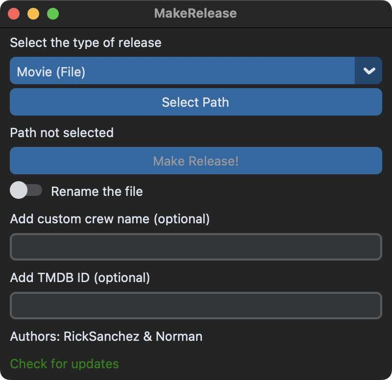

# makerelease

[](LICENSE)
[](https://github.com/astral-sh/ruff)
[](https://discord.gg/jQmm9jhbyu)

**makerelease** è un comodo script per velocizzare la pubblicazione di film e serie tv sui forum P2P italiani.

> ⚠️ **ATTENZIONE**: Questo repository è pubblicato a scopo informativo e didattico.

## 🚩 Indice

- [Funzionalità](#-funzionalità)
- [Requisiti](#-requisiti)
- [Installazione](#%EF%B8%8F-installazione)
  - [Windows](#-windows)
  - [macOS](#-macos)
  - [Linux](#-linux)
- [Aggiornamento](#-aggiornamento)
- [Configurazione](#%EF%B8%8F-configurazione)
- [Utilizzo](#-utilizzo)
  - [GUI](#gui)
  - [Linea di comando](#linea-di-comando)
- [Autori](#-autori)
  - [Contributors](#%EF%B8%8F-contributors)
- [Licenza](#-licenza)

## ✨ Funzionalità

- Ottiene i dati di film e serie tv da TheMovieDB
- Crea il report con MediaInfo o AVInaptic
- Crea il file .torrent e genera il link magnet
- Estrae gli screenshot
- Genera il grafico del bitrate
- Carica tutte le immagini su Imgur, ImgBB o Imgbly
- Prepara il testo del post da pubblicare sul forum con template completamente personalizzabili
- Formatta il titolo della release seguendo un formato consigliato

Sono supportati diversi tipi di release:

- **Film**
    1. **Film**: seleziona un singolo file `mkv`, `mp4` o `avi`
    2. **Film + Extra**: seleziona una directory contenente un file video e un numero arbitrario di cartelle `Extra`, `Featurettes`, ecc. La procedura è identica al caso precedente, l'unica differenza è l'aggiunta della directory nel torrent.
- **Serie TV**
    1. **Stagione singola**: seleziona una directory contenente più file video. Lo script identifica la serie dal nome della cartella.
    2. **Serie completa**: seleziona una directory contenente più cartelle. Lo script identifica la serie dal nome della cartella principale.

## 📦 Requisiti

- [Python](https://www.python.org) (3.9 o più recente)
- [FFmpeg](https://ffmpeg.org)
- [MediaInfo](https://mediaarea.net/MediaInfo) / [AVInaptic](http://fsinapsi.altervista.org/code/avinaptic/)

## ⚒️ Installazione

### 🪟 Windows

1. Installa Python

    ```bash
    winget install Python.Python.3.12
    ```

2. Installa Git

    ```bash
    winget install Git.Git
    ```

3. Installa FFmpeg

    ```bash
    winget install Gyan.FFmpeg
    ```

4. Clona il repository

    ```bash
    git clone https://github.com/c137ricksanchez/makerelease.git
    ```

5. Entra nella directory

    ```bash
    cd makerelease
    ```

6. Installa il pacchetto e le dipendenze

    > ⚠️ Installa le dipendenze all'interno di un [ambiente virtuale (venv)](https://pytutorial-it.readthedocs.io/it/python3.12/venv.html#creare-un-virtual-environment) per evitare conflitti con altri script.

    ```bash
    pip install -e .
    ```

### 🍎 macOS

1. Installa Homebrew

    ```bash
    /bin/bash -c "$(curl -fsSL https://raw.githubusercontent.com/Homebrew/install/HEAD/install.sh)"
    ```

2. Installa Python

    ```bash
    brew install python
    ```

3. Installa Git

    ```bash
    brew install git
    ```

4. Installa FFmpeg

    ```bash
    brew install ffmpeg
    ```

5. Clona il repository

    ```bash
    git clone https://github.com/c137ricksanchez/makerelease.git
    ```

6. Entra nella directory

    ```bash
    cd makerelease
    ```

7. Installa il pacchetto e le dipendenze

    > ⚠️ Installa le dipendenze all'interno di un [ambiente virtuale (venv)](https://pytutorial-it.readthedocs.io/it/python3.12/venv.html#creare-un-virtual-environment) per evitare conflitti con altri script.

    ```bash
    pip install -e .
    ```

### 🐧 Linux

1. Installa Git, FFmpeg e MediaInfo
2. Clona il repository

    ```bash
    git clone https://github.com/c137ricksanchez/makerelease.git
    ```

3. Entra nella directory

    ```bash
    cd makerelease
    ```

4. Installa il pacchetto e le dipendenze

    > ⚠️ Installa le dipendenze all'interno di un [ambiente virtuale (venv)](https://pytutorial-it.readthedocs.io/it/python3.12/venv.html#creare-un-virtual-environment) per evitare conflitti con altri script.

    ```bash
    pip install -e .
    ```

## 🔄 Aggiornamento

1. Aggiorna il repository

    ```bash
    git pull
    ```

2. Aggiorna eventuali dipendenze

    ```bash
    pip install -e .
    ```

## ⚙️ Configurazione

Crea una copia della cartella `config_example` chiamandola `config` e modifica i file all'interno per configurare lo script.

### `keys.json`

- `imgbb`: Se desideri caricare le immagini su ImgBB, ottieni la [chiave API](https://api.imgbb.com/) e inseriscila qui. **Lascia vuoto per utilizzare Imgur!**
- `tmdb`: Inserisci la chiave delle API di TheMovieDB (se non ne hai una, registrati e [ottienila qui](https://www.themoviedb.org/settings/api))
- `imgbly`: Il caricamento su ImgBly è disattivato di default, attivandolo verrà utilizzato come scelta primaria. ImgBly verrà sempre utilizzato in caso di fallimento nel caricamento delle immagini su Imgur o su ImgBB, o in caso di screenshot troppo grandi (Imgur supporta al max. 20 MB mentre ImgBB 32 MB)

### `screenshots.txt`

Inserisci i timestamp dove lo script andrà ad estrarre gli screenshot (nel formato `HH:MM:SS`).

### `template.jinja`

Modifica il template del post in base alle tue preferenze. Le variabili verranno sostituite in automatico con i dati del film o della serie tv.

#### Variabili supportate

- `{{ TITLE }}` - Titolo
- `{{ ORIGINAL_TITLE }}` - Titolo originale
- `{{ YEAR }}` - Anno di uscita
- `{{ RUNTIME }}` - Durata
- `{{ PLOT }}` - Trama
- `{{ GENRE }}` - Genere
- `{{ DIRECTOR }}` - Regista
- Il `CAST` è una lista di persone, ciascuna con due attributi: `actor`, cioè il nome dell'attore, e `character`, cioè il nome del suo personaggio, e va mostrato con una formula di questo tipo che consente flessibilità nel come si vuole la lista di output:
    ```jinja
    [list]
    
    [*] {{ person.actor }}: {{ person.character }}
    
    [/list]
    ```
- `{{ COUNTRY }}` - Paese di produzione
- `{{ POSTER_URL }}` - URL del poster
- `{{ TMDB_URL }}` - URL della pagina TheMovieDB
- `{{ TRAILER }}` - URL al trailer su YouTube
- `{{ SCREENSHOTS }}` - URL degli screenshot
- `{{ BITRATE_GRAPH }}` - URL del grafico del bitrate (se non presente, la generazione del grafico verrà saltata)
- `{{ REPORT_MEDIAINFO }}` - Report generato con MediaInfo
- `{{ REPORT_AVINAPTIC }}` - Report generato con AVInaptic
- `{{ SIZE }}` - Dimensione del torrent
- `{{ MAGNET }}` - Link magnet
- `{{ TREE }}` - Elenco dei file, di default è incluso in una formula che lo stampa solo se la release è di tipo `movie_folder`, `tv_single` oppure `tv_multi`
    ```jinja
    
    [b][size=150]CONTENUTO[/size][/b]

    [code]
    {{ TREE }}
    [/code]
    
- `{{ EP_COUNT }}` - Numero degli episodi, di default è incluso in una formula che lo stampa solo se la release è di tipo `tv_single` oppure `tv_multi`
    ```jinja
    
    Numero episodi: [b]{{ EP_COUNT }}[/b]
    
    ```

#### Multi-template

Puoi creare molteplici file template, sarà sufficiente differenziarli utilizzando il carattere underscore (`_`). Esempio: `template_a.jinja` oppure `template_b.jinja`. Il risultato sarà un file `post.txt` differente per ciascun template, nominato come il file template, quindi `post_a.txt` oppure `post_b.txt`.

### `trackers.txt`

Inserisci la _trackers list_ da usare durante la creazione del torrent.

## 🚀 Utilizzo

### GUI

Apri il terminale ed esegui:

```bash
python gui.py
```



### Linea di comando

Apri il terminale ed esegui il comando utilizzando i flag riportati sotto per scegliere le opzioni:

```bash
python makerelease.py [PATH] -t [TYPE]
```

| Long       | Short | Default | Descrizione                                                                                                              |
| ---------- | ----- | ------- | ------------------------------------------------------------------------------------------------------------------------ |
| `--type`   | `-t`  | `movie` | Tipo di release, a scelta tra: `movie`, `movie_folder`, `tv_single`, `tv_multi`                                          |
| `--id`     | `-i`  |         | ID del titolo su TheMovieDB (facoltativo - se non passato, verrà fatta una ricerca e chiesto quale risultato utilizzare) |
| `--crew`   | `-c`  |         | Nome della crew da inserire alla fine del nome del file (facoltativo)                                                    |
| `--rename` | `-r`  | `False` | Rinomina in automatico il file seguendo il formato consigliato                                                           |
| `--help`   | `-h`  |         | Mostra il messaggio di aiuto con le informazioni su come usare il comando                                                |

## 🧑‍💻 Autori

- [Rick Sanchez](https://github.com/c137ricksanchez)
- [Norman](https://github.com/Norman2034)

### ❤️ Contributors

- [AlbyGNinja](https://github.com/AlbyGNinja)
- [whit3r0se](https://github.com/whit3r0se)

## 📜 Licenza

[MIT](LICENSE)
